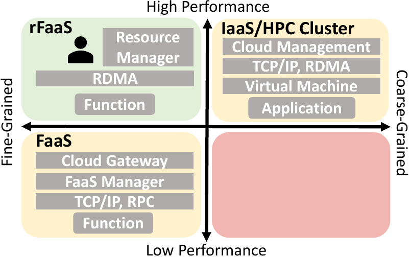

# rFaaS: RDMA-Enabled FaaS Platform for Serverless High-Performance Computing

**A high-performance FaaS platform with RDMA acceleration for function invocations.**


[](docs/systems_comparison.png)
The cloud paradigm Function-as-a-Service (FaaS) provides an ability to execute stateless and fine-grained functions on elastic and ephemeral resources. However, serverless struggles to achieve the performance needed in high-performance computing: slow invocations, low network bandwidth, and the overheads of the FaaS management system make it difficult to incorporate serverless functions when every millisecond counts. Therefore, we decided to combine the best of both worlds: elasticity of FaaS and high-performance of cluster batch systems. We built a new FaaS platform with RDMA-accelerated network transport.

rFaaS is a serverless platform redesigned to support high-performance and low-latency invocations with a direct RDMA connection. 
In rFaaS, the centralized schedulers and API gateway are replaced with a decentralized allocation mechanism. Instead of using a traditional cloud trigger, HPC applications query executor servers, obtain resource allocation and establish RDMA connections to remote workers. Every function is invoked by writing input data directly to the memory of the worker. This allows us to achieve a single-digit microsecond hot invocation latency - hot invocations add less than 350 nanoseconds overhead on top of the fastest available network transmission.

To use rFaaS, please read the documentation on [software and hardware requirements](#requirements), [installation instructions](#installation), and [the basic example of using rFaaS](#usage). rFaaS comes with a set of [benchmark](docs/benchmarks.md) applications and [tests](docs/testing). We provide an extended set of [C++ serverless functions](docs/examples.md), including multimedia and ML inference examples from [the serverless benchmarking suite SeBS](https://github.com/spcl/serverless-benchmarks). Finally, you can find more details about rFaaS in the documentation on the [system](docs/system.md) and the [client rFaaS library](docs/client_library.md).

Do you have further questions not answered by our documentation? Did you encounter troubles with installing and using rFaaS? Or do you want to use rFaaS in your work and you need new features? Feel free to reach us through GitHub issues or by writing to <marcin.copik@inf.ethz.ch>.

### Paper

When using rFaaS, please cite our [arXiv paper preprint](https://arxiv.org/abs/2106.13859), and you can
find more details about research work [in this paper summary](mcopik.github.io/projects/rfaas/).
You can cite our software repository as well, using the citation button on the right.

```
@inproceedings{copik2023rfaas,
  title={{r}FaaS: Enabling High Performance Serverless with RDMA and Leases},
  author={Marcin Copik and Konstantin Taranov and Alexandru Calotoiu and Torsten Hoefler},
  year={2023},
  series = {IPDPS '23},
  booktitle = {Proceedings of the 37th IEEE Interational Parallel and Distributed Processing Symposium},
  eprint={2106.13859},
}
```

## Requirements

**Hardware** `rFaaS` supports SoftROCE and RoCE RDMA NICs with the help of `ibverbs`.
Evaluation and testing with IB fabric is currently in progress.

In future versions, we plan for `rFaaS` to support Cray interconnect through `libfabric` and
its `ugni` provider.

**Software** Currently, `rFaaS` works only on Linux systems as we realy heavily on POSIX interfaces. We require the following libraries and tools:

- CMake >= 3.11.
- C++ compiler with C++17 support.
- `libibverbs` with headers installed.
- `librdmacm` with headers installed.

Furthermore, we fetch and build the following dependencies during CMake build - unless
they are found already in the system.

- [spdlog](https://github.com/gabime/spdlog) 1.8
- [cereal](https://uscilab.github.io/cereal/) 1.3
- [readerwriterqueue](https://github.com/cameron314/readerwriterqueue) 1.0.6
- [pistache](https://github.com/pistacheio/pistache) 0.0.5
- [cxxopts](https://github.com/jarro2783/cxxopts) 
- [googletest](https://github.com/google/googletest)

**Containers**
`rFaaS` supports two types of function executors - a bare-metal process and a Docker container. For Docker, we use the SR-IOV plugin from Mellanox to run Docker-based function executors with virtual NIC device functions. Please follow [Mellanox documentation and instructions](https://community.mellanox.com/s/article/Docker-RDMA-SRIOV-Networking-with-ConnectX4-ConnectX5-ConnectX6) to install and configure the plugin.
`rFaaS` expects that `docker_rdma_sriov` binary is available in `PATH`.

In future versions, we plan to support Singularity containers and offer a simpler, but less secure Docker networking.

## Installation

To build rFaaS, run the following CMake configuration:

```bash
cmake -DCMAKE_CXX_COMPILER=<your-cxx-compiler> -DCMAKE_BUILD_TYPE=Release <source-dir>
cmake --build .
```

To enable more verbose logging, change the CMake configuration parameter to: `-DCMAKE_BUILD_TYPE=Debug`.

The CMake installation has the following optional configuration parameters.

| Arguments                                                            	|                                              		|
|-------------------------------------------------------------------|----------------------------------------------|
| <i>WITH_EXAMPLES</i>                                       	| **EXPERIMENTAL** Build additional examples ([see examples subsection](docs/examples.md) for details on additional dependencies).              						|
| <i>WITH_TESTING</i>                                        	| **EXPERIMENTAL** Enable testing - requires providing JSON testing configuration as the value of this flag. See [testing](#testing) subsection for details.	|
| <i>CXXOPTS_PATH</i>                                         	 | Path to an existing installation of the `cxxopts` library; disables the automatic fetch and build of the library. |
| <i>SPDLOG_PATH</i>                                         	 | Path to an existing installation of the `spdlog` library; disables the automatic fetch and build of the library. |
| <i>LIBRDMACM_PATH</i>                                        | Path to a installation directory of the `librdmacm` library. |

## Usage

To learn how to use rFaaS, please follow the [tutorial](docs/tutorial.md) 

For an in-depth analysis of each component and their configuration, please look at [the system documentation](docs/system.md).

## Authors & Contributors

* [Marcin Copik (ETH Zurich)](https://github.com/mcopik/) - main author.
* [Konstantin Taranov (ETH Zurich)](https://github.com/TaranovK) - troubleshooting and optimizating RDMA.
* [Marcin Chrapek (ETH Zurich)](https://github.com/marchrap) - libfabrics port and support for Cray GNI.
* [ Nicolò Monaldini (University of Bologna)](https://github.com/nicolo-mn) - improvements to build and RDMA toolchains.
