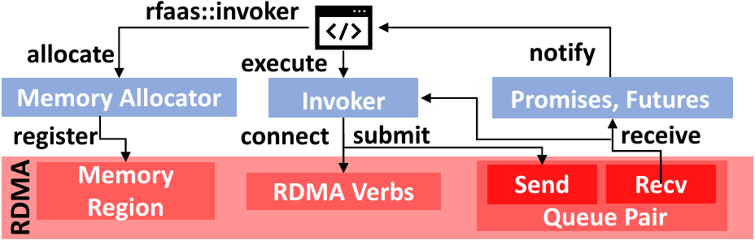

## `rfaas::allocator`

Managing RDMA-aware memory buffers.

## `rfaas::executor`

The main mechanism of allocating resources and invoking functions.

## `rfaas::devices`

List of RDMA devices on the system.

## `rfaas::servers`

List of available rFaaS resources.

