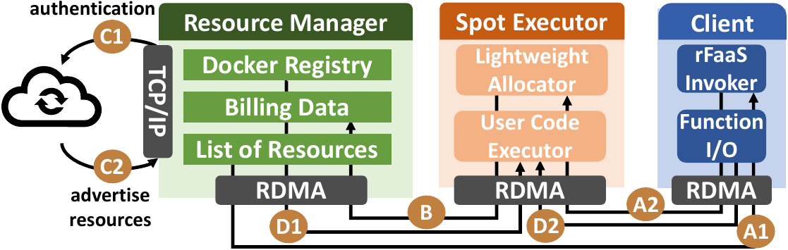

## rFaaS System

### RDMA Devices

- max inline
- default receive buffer size
- testing

The `max_inline_data` is particularly important because it cannot be queried with the help of `ibv_devinfo` tool.
It corresponds to the maximal size of packet that can be inlined with an RDMA packet, providing further performance improvements for invocations with a small payload.
When in doubt, set it to zero - this will disable any inlining.

The `default_receive_buffer_size`

### Resource Manager

### Executor Manager (Lightweight Allocator)

### User Code Executor

### Functions

### Accounting

### Docker Registry

## System Configuration

